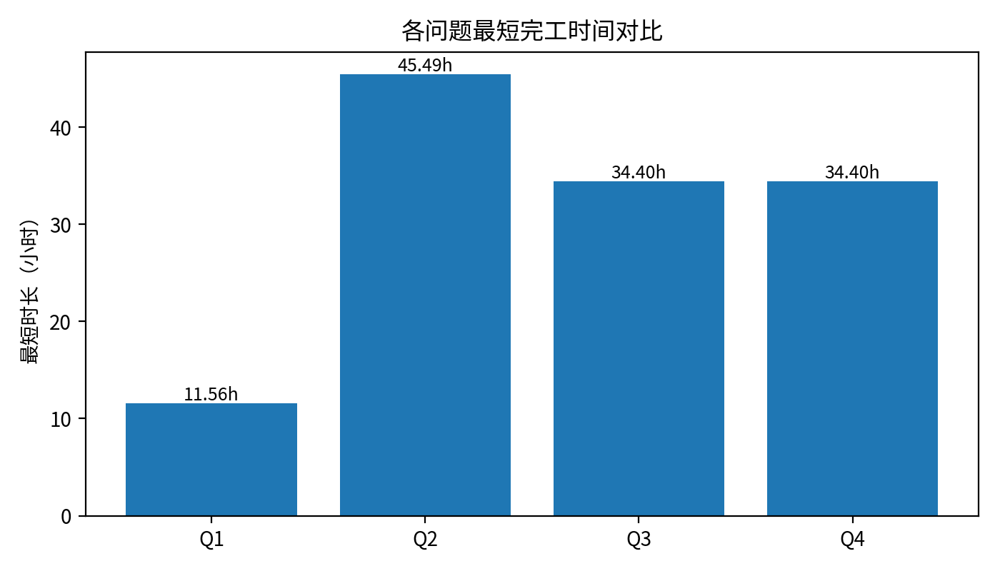
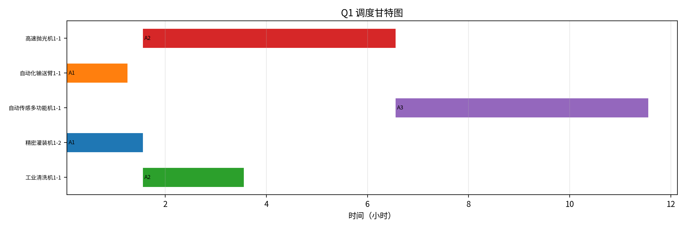
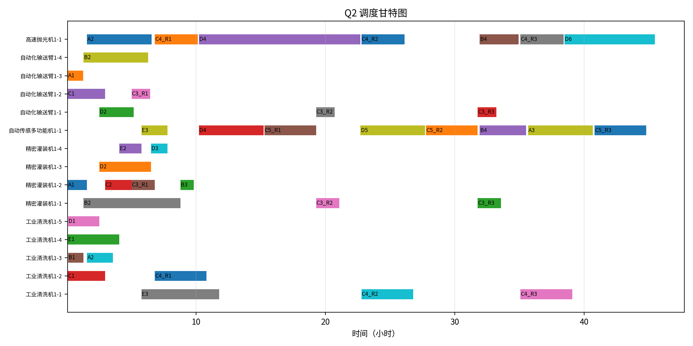
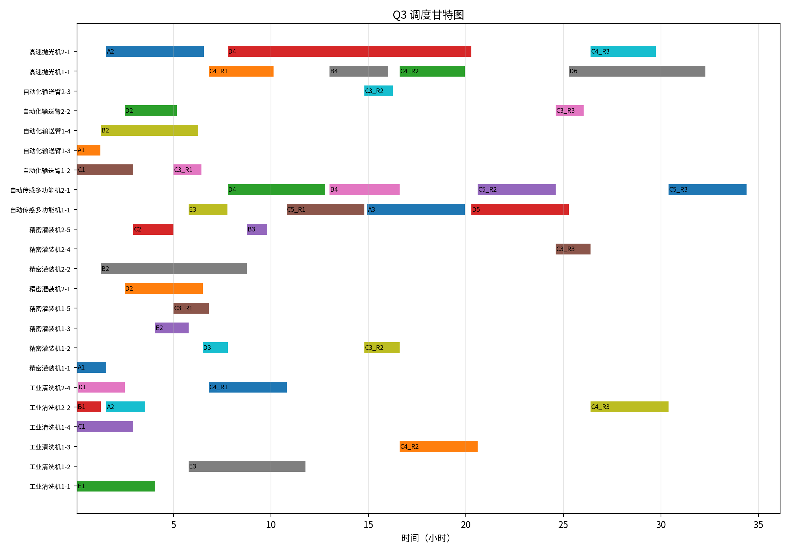
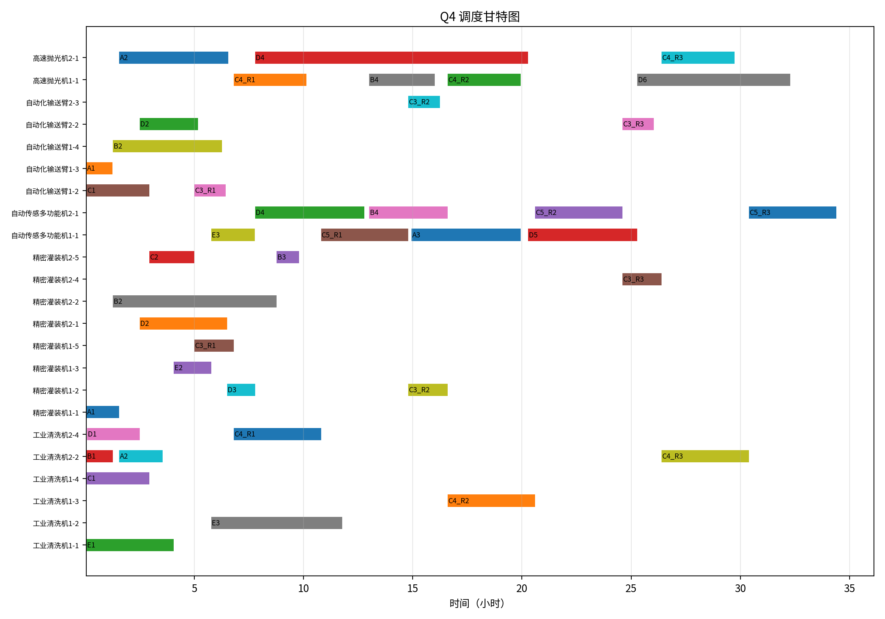

# B题 多工序协同作业问题研究论文初稿

> 版本：Markdown 初稿  
> 日期：2026-06-19  
> 状态：用于后续排版与润色的完整正文草稿，数值结果已按当前复审结论冻结。  

---

## 摘要

针对五个车间集中整修任务中的多工序协同作业问题，本文将其抽象为带车间内工序链约束、同类设备可替代、双设备协同作业以及跨车间序列相关运输时间的多资源调度问题。首先根据附件数据对 C 车间循环工序进行展开，将原始工序转化为 27 个工序实例和 41 个设备子任务；然后建立以最小化全部任务完工时间为目标的混合整数规划模型，并通过设备分配变量、工序开始时间变量和同设备排序变量刻画工序顺序、设备互斥与跨车间转运约束。针对追加设备购置预算的问题，进一步引入采购变量和预算约束，形成采购-调度联合优化模型。

在求解方面，本文使用精确优化模型获得四个问题的可行调度方案，并通过独立下界与显式采购模型验证最优性。结果表明：问题一中班组 1 完成 A 车间的最短时长为 41600 秒；问题二中仅使用班组 1 完成五个车间的最短时长为 163764 秒；问题三中两班组共同作业的最短时长为 123844 秒；问题四中在 50 万元购置预算下，最短时长仍为 123844 秒，最优采购方案为不购置任何设备。进一步地，问题一由 A 车间工序链下界证明最优，问题二由高速抛光机和自动传感多功能机双瓶颈资源松弛下界证明最优，问题三和问题四由 C 车间关键工序链下界及显式采购模型证明最优。该方案不仅给出满足题目要求的设备调度表和采购方案，也为多车间协同调度问题提供了可复现、可解释的精确建模框架。

**关键词**：多工序协同作业；柔性作业车间调度；混合整数规划；CP-SAT；关键路径；设备购置优化

---

## 1 问题重述

某工业制造系统需要对 A、B、C、D、E 五个车间开展集中整修任务。每个车间包含若干有固定先后顺序的工序，工序编号由小到大表示执行顺序。不同工序需要占用不同类型的设备，部分工序需要两类设备共同参与；若一道工序需要两类设备，则两类设备均需完成该工序对应工程量，只有当两类设备均完成后，该工序才可判定完成。

系统中共有两个班组，每个班组配备若干台不同类型设备。设备在不同工序之间可重复使用，但同一时刻每台设备只能服务一道工序。同一设备在同一车间内切换工序时不计运输时间，而跨车间作业时需要计入设备转运时间。转运时间由车间距离和设备移动速度确定，设备移动速度为 2 m/s，持续作业时间和运输时间均按秒向上取整。

题目要求解决以下四个递进问题：

1. 仅由班组 1 独立承担 A 车间全部整修任务，求最短完工时长并给出设备调度表。
2. 仅使用班组 1 设备完成 A-E 五个车间全部任务，求最短完工时长并给出设备调度表。
3. 使用班组 1 和班组 2 设备共同完成五个车间全部任务，求最短完工时长并给出带班组信息的设备调度表。
4. 在 50 万元设备购置预算下，综合确定设备购置方案与作业调度策略，使全部任务完成时间最短，并给出调度表和采购表。

该问题本质上是一个带运输时间的多资源调度问题。其难点主要体现在：车间内部工序必须严格按链式顺序执行；同类设备存在多台可替代机器；双设备工序需要同步协调；同一设备跨车间作业时存在序列相关转运时间；最后一问还引入了预算约束下的设备扩容决策。

---

## 2 问题分析

### 2.1 调度结构分析

题目中每个车间的整修任务均构成一条工序链。例如 A 车间必须按 A1、A2、A3 顺序执行；D 车间必须按 D1 至 D6 顺序执行。C 车间较为特殊，除 C1、C2 外，C3、C4、C5 需要重复执行三轮，因此展开后 C 车间工序链为：

```text
C1 -> C2 -> C3_R1 -> C4_R1 -> C5_R1
           -> C3_R2 -> C4_R2 -> C5_R2
           -> C3_R3 -> C4_R3 -> C5_R3
```

展开后，五个车间共形成 27 个工序实例。由于部分工序需要两类设备，各工序进一步拆分为 41 个设备子任务。设备子任务是模型中进行设备分配和互斥约束的基本单位。

### 2.2 关键瓶颈分析

班组配置中，自动化输送臂、工业清洗机、精密灌装机数量较多，而高速抛光机和自动传感多功能机每个班组仅各 1 台。对于单班组场景，后两类设备天然成为瓶颈资源。问题二的最优性证明也正是围绕这两台单机瓶颈展开。

当两个班组共同参与后，设备数量翻倍，单台设备瓶颈有所缓解。此时 C 车间的固定工序链成为不可压缩的关键路径。由于车间内部工序必须严格顺序执行，新增设备只能改善不同车间或不同工序之间的并行能力，无法缩短 C 车间链上每一道工序的固有作业时长。因此，问题三和问题四的最短完工时间均由 C 车间关键链决定。

### 2.3 总体结果

本文得到的四问最短时长如表 1 所示。

**表 1 四个问题最短时长汇总**

| 问题 | 资源条件 | 最短时长(s) | 时:分:秒 | 最优性依据 |
|---|---|---:|---|---|
| 问题一 | 班组 1，A 车间 | 41600 | 11:33:20 | A 车间工序链下界 |
| 问题二 | 班组 1，五车间 | 163764 | 45:29:24 | 双瓶颈资源松弛下界 |
| 问题三 | 班组 1 + 2，五车间 | 123844 | 34:24:04 | C 车间关键链下界 |
| 问题四 | 双班组 + 50 万预算 | 123844 | 34:24:04 | C 链下界 + 显式采购模型 |

四问完工时间对比如图 1 所示。



---

## 3 模型假设

为使模型可计算且与题意一致，本文作如下假设：

1. 每台设备初始位置为其所属班组驻地，首次进入某车间作业前必须满足从班组驻地到该车间的转运时间。
2. 同一台设备在同一车间内连续执行不同工序时，设备转运时间忽略。
3. 同一台设备跨车间作业时，转运时间为车间间距离除以 2 m/s 后向上取整。
4. 对需要两类设备的工序，两类设备同时投入并分别完成该工序对应工程量；工序完成时间取两类设备完成时间的较晚者。
5. 所有设备子任务的工作时间均按秒计，并由工程量和设备效率计算后向上取整。
6. 问题四中，新增购置设备与同类型原有设备具有相同效率、移动速度和使用规则，且购买后立即可用于调度。
7. 优化目标首先为最小化总完工时间；在总完工时间相同情况下，问题四进一步选择采购费用最小的方案。

其中假设 4 对双设备协同工序的处理符合题目“不考虑两类设备先后顺序、不考虑两类设备之间等待时间”的表述。并且在问题三、四中，调度方案已经达到与该假设无关的 C 车间关键链下界，因此该处理不会影响最终最短工期结论。

---

## 4 符号说明

### 4.1 集合

| 符号 | 含义 |
|---|---|
| $J$ | 展开后的工序集合 |
| $O$ | 设备子任务集合 |
| $M$ | 设备集合 |
| $K$ | 设备类型集合 |
| $W$ | 车间集合 |
| $C$ | 班组集合 |

### 4.2 参数

| 符号 | 含义 |
|---|---|
| $w(j)$ | 工序 $j$ 所属车间 |
| $seq(j)$ | 工序 $j$ 在其车间内的顺序 |
| $\tau(o)$ | 子任务 $o$ 所需设备类型 |
| $j(o)$ | 子任务 $o$ 所属工序 |
| $p_o$ | 子任务 $o$ 的作业时长 |
| $d_j$ | 工序 $j$ 的链式占用时长 |
| $r_{u,v}$ | 位置 $u$ 到位置 $v$ 的转运时间 |
| $origin(m)$ | 设备 $m$ 初始所属班组驻地 |
| $price_k$ | 类型 $k$ 设备单价 |
| $B$ | 采购预算，本文中 $B=500000$ |

### 4.3 决策变量

| 符号 | 含义 |
|---|---|
| $S_j$ | 工序 $j$ 的开始时间 |
| $T$ | 全部任务的完工时间 |
| $x_{o,m}$ | 子任务 $o$ 是否分配给设备 $m$ |
| $y_{a,b,m}$ | 若子任务 $a,b$ 分配给同一设备 $m$，$a$ 是否排在 $b$ 前 |
| $z_m$ | 问题四中候选增购设备 $m$ 是否购买 |

---

## 5 数据预处理

### 5.1 工序展开

附件中的工序流程表给出各车间工序及所需设备。对于 C 车间，题目要求 C3、C4、C5 三道工序重复三轮。本文将其展开为：

```text
C3_R1, C4_R1, C5_R1,
C3_R2, C4_R2, C5_R2,
C3_R3, C4_R3, C5_R3
```

因此，C 车间总工序数由 5 道扩展为 11 道，五个车间合计形成 27 个工序实例。

### 5.2 作业时长计算

对于设备子任务 $o$，其作业时长由工程量和设备效率计算：

$$
p_o=\left\lceil \frac{q_{j(o)}}{v_o}\times 3600 \right\rceil ,
$$

其中 $q_{j(o)}$ 为工序工程量，$v_o$ 为对应设备效率，单位为 m³/h。

若工序 $j$ 需要多类设备共同完成，则工序链中该工序占用的最短时间为：

$$
d_j=\max_{o:j(o)=j} p_o.
$$

例如，A1 需要精密灌装机和自动化输送臂。二者对应持续时间分别为 5400 秒和 4320 秒，因此 A1 的工序链占用时长为 5400 秒。

### 5.3 转运时间计算

若设备从位置 $u$ 移动到位置 $v$，转运时间为：

$$
r_{u,v}=\left\lceil \frac{D_{u,v}}{2}\right\rceil ,
$$

其中 $D_{u,v}$ 为附件中给出的距离，单位为米。若 $u=v$，则 $r_{u,v}=0$。

---

## 6 固定设备调度模型

问题一至问题三均可视为固定设备集合下的调度问题，区别仅在于允许使用的车间和设备集合不同。问题一只考虑 A 车间和班组 1；问题二考虑五个车间和班组 1；问题三考虑五个车间和两个班组。

### 6.1 目标函数

以最小化全部任务完工时间为目标：

$$
\min T.
$$

### 6.2 设备子任务唯一分配约束

每个设备子任务必须且只能分配给一台对应类型设备：

$$
\sum_{m\in M:\ type(m)=\tau(o)} x_{o,m}=1,\quad \forall o\in O.
$$

### 6.3 车间内部工序链约束

若工序 $a$ 和 $b$ 属于同一车间，且 $b$ 是 $a$ 的后续相邻工序，则：

$$
S_b\ge S_a+d_a.
$$

该约束保证各车间内部工序严格按照题目给定顺序执行。

### 6.4 完工时间约束

对于任意工序 $j$，总完工时间不得早于该工序完成时间：

$$
T\ge S_j+d_j,\quad \forall j\in J.
$$

### 6.5 初始到达约束

若子任务 $o$ 分配给设备 $m$，则所属工序开始时间不得早于设备从班组驻地到达该车间的时间：

$$
S_{j(o)}\ge r_{origin(m),w(j(o))}x_{o,m}.
$$

### 6.6 同设备互斥与跨车间转运约束

若两个子任务 $a,b$ 由同一台设备 $m$ 执行，则二者不能重叠。若 $a$ 在 $b$ 之前，则：

$$
S_{j(b)}\ge S_{j(a)}+p_a+r_{w(j(a)),w(j(b))}.
$$

若 $b$ 在 $a$ 之前，则：

$$
S_{j(a)}\ge S_{j(b)}+p_b+r_{w(j(b)),w(j(a))}.
$$

这是一类带序列相关准备时间的设备互斥约束。实际计算中可用 big-M 线性化，也可用 CP-SAT 的逻辑约束表达。本文求解结果由 MILP 得到，并通过 CP-SAT 构造关键松弛模型和采购模型进行交叉验证。

---

## 7 问题一：班组 1 完成 A 车间

问题一只涉及 A 车间，工序顺序为：

```text
A1 -> A2 -> A3
```

班组 1 到 A 车间距离为 400 m，设备速度为 2 m/s，因此最早到达时间为：

$$
400/2=200\text{s}.
$$

A 车间三道工序的链式占用时间分别为：

| 工序 | 设备需求 | 工序链占用时间(s) |
|---|---|---:|
| A1 | 精密灌装机、自动化输送臂 | 5400 |
| A2 | 高速抛光机、工业清洗机 | 18000 |
| A3 | 自动传感多功能机 | 18000 |

因此，任意可行方案的完工时间均满足：

$$
T\ge 200+5400+18000+18000=41600\text{s}.
$$

优化模型给出的排程恰好达到 41600 秒，故问题一最短完工时间为：

$$
\boxed{41600\text{s}=11:33:20}.
$$

问题一调度甘特图如图 2 所示。



问题一设备调度表见表 2。

**表 2 问题一设备调度结果**

| 序号 | 设备编号 | 起始时间 | 结束时间 | 持续工作时间(s) | 工序编号 |
|---:|---|---|---|---:|---|
| 1 | 精密灌装机1-1 | 00:03:20 | 01:33:20 | 5400 | A1 |
| 2 | 自动化输送臂1-4 | 00:03:20 | 01:15:20 | 4320 | A1 |
| 3 | 工业清洗机1-5 | 01:33:20 | 03:33:20 | 7200 | A2 |
| 4 | 高速抛光机1-1 | 01:33:20 | 06:33:20 | 18000 | A2 |
| 5 | 自动传感多功能机1-1 | 06:33:20 | 11:33:20 | 18000 | A3 |

---

## 8 问题二：班组 1 完成五车间

问题二使用班组 1 的设备完成五个车间全部任务。相比问题一，问题二新增了多车间并行、设备跨车间转运和单班组资源竞争。

班组 1 中高速抛光机和自动传感多功能机均只有 1 台。由于 A、B、C、D 等车间的关键工序均需要这两类设备，它们构成问题二的主要瓶颈。为证明最优性，本文构造如下松弛模型：

1. 保留所有车间内部工序链约束。
2. 保留所有工序最短占用时间 $d_j$。
3. 保留班组 1 初始到达各车间的时间约束。
4. 仅对高速抛光机和自动传感多功能机保留设备互斥和跨车间转运时间。
5. 放松自动化输送臂、工业清洗机、精密灌装机的设备互斥冲突。

该松弛模型删除了部分资源冲突，故其最优值是原问题的合法下界。CP-SAT 求解该松弛模型得到：

$$
LB_{Q2}=163764\text{s}.
$$

完整调度模型同时给出一组完工时间为 163764 秒的可行排程，因此：

$$
163764\le OPT(Q2)\le 163764.
$$

故问题二全局最优完工时间为：

$$
\boxed{163764\text{s}=45:29:24}.
$$

问题二调度甘特图如图 3 所示。



双瓶颈资源松弛模型中的关键设备序列如表 3 和表 4 所示。它们说明在单班组情况下，完工时间主要由高速抛光机和自动传感多功能机的占用顺序决定。

**表 3 高速抛光机瓶颈序列**

| 工序 | 车间 | 开始 | 结束 | 本设备时长(s) |
|---|---|---|---|---:|
| A2 | A | 01:33:20 | 06:33:20 | 18000 |
| C4_R1 | C | 06:48:04 | 10:08:04 | 12000 |
| D4 | D | 10:12:24 | 22:42:24 | 45000 |
| C4_R2 | C | 22:46:44 | 26:06:44 | 12000 |
| B4 | B | 31:55:54 | 34:55:54 | 10800 |
| C4_R3 | C | 35:05:04 | 38:25:04 | 12000 |
| D6 | D | 38:29:24 | 45:29:24 | 25200 |

**表 4 自动传感多功能机瓶颈序列**

| 工序 | 车间 | 开始 | 结束 | 本设备时长(s) |
|---|---|---|---|---:|
| E3 | E | 05:46:12 | 07:46:12 | 7200 |
| D4 | D | 10:12:24 | 15:12:24 | 18000 |
| C5_R1 | C | 15:16:44 | 19:16:44 | 14400 |
| D5 | D | 22:42:24 | 27:42:24 | 18000 |
| C5_R2 | C | 27:46:44 | 31:46:44 | 14400 |
| B4 | B | 31:55:54 | 35:31:54 | 12960 |
| A3 | A | 35:40:24 | 40:40:24 | 18000 |
| C5_R3 | C | 40:49:09 | 44:49:09 | 14400 |

完整的问题二设备调度表较长，本文将其作为附录表 A.1 给出。

---

## 9 问题三：两班组共同完成五车间

问题三允许使用班组 1 和班组 2 的全部设备。两班组设备配置相同，因此各类设备数量相比问题二翻倍。设备数量增加后，单台设备瓶颈显著缓解，但 C 车间工序链成为不可压缩的全局关键路径。

C 车间展开后的工序链为：

```text
C1 -> C2 -> (C3 -> C4 -> C5) * 3
```

其不含初始转运的最短链长为：

$$
\begin{aligned}
L_C &= 10368+7406+3(6480+14400+14400)\\
&=123614\text{s}.
\end{aligned}
$$

两班组到 C 车间的初始转运时间分别为：

| 班组 | 到 C 车间距离(m) | 转运时间(s) |
|---|---:|---:|
| 班组 1 | 460 | 230 |
| 班组 2 | 620 | 310 |

因此任意调度方案的完工时间满足：

$$
T\ge 123614+230=123844\text{s}.
$$

完整调度模型给出的两班组排程达到该下界，因此问题三全局最优完工时间为：

$$
\boxed{123844\text{s}=34:24:04}.
$$

问题三调度甘特图如图 4 所示。



从甘特图可以看出，在两班组共同参与后，多个车间工序能够并行推进，但 C 车间链上工序仍必须依次完成。最终完工时刻对应 C5_R3 的完成，说明 C 车间关键链确实决定了全局工期。

完整的问题三设备调度表较长，本文将其作为附录表 A.2 给出。

---

## 10 问题四：预算约束下的设备购置与调度

问题四在问题三基础上增加 50 万元设备购置预算。企业希望通过补增设备资源进一步缩短完工时间。为避免仅凭经验判断购置方案，本文建立显式采购-调度联合模型。

### 10.1 采购模型

对每一台候选增购设备 $m$，定义二元变量：

$$
z_m=
\begin{cases}
1,&\text{购买设备 }m,\\
0,&\text{不购买设备 }m.
\end{cases}
$$

预算约束为：

$$
\sum_m price_m z_m\le 500000.
$$

若某设备子任务分配给增购设备 $m$，则必须购买该设备：

$$
x_{o,m}\le z_m.
$$

在此基础上，调度部分沿用固定设备模型中的工序链、设备互斥、初始到达和跨车间运输约束。

### 10.2 字典序优化

问题四的首要目标是最小化总完工时间。因此第一阶段求解：

$$
\min T.
$$

在得到最优完工时间 $T^\*$ 后，第二阶段固定 $T=T^\*$，再最小化采购费用：

$$
\min \sum_m price_mz_m.
$$

这种字典序优化方式符合“先缩短工期；若工期相同则减少购置成本”的决策逻辑。

### 10.3 结果分析

显式采购模型求得第一阶段最优完工时间仍为：

$$
T^\*=123844\text{s}.
$$

第二阶段在固定 $T=123844$ 秒的条件下，得到最小采购费用为 0 元。因此问题四最优采购方案为所有设备均购买 0 台。

该结论也可由 C 车间关键链解释。问题三已经达到 C 车间关键链下界：

$$
123614+230=123844\text{s}.
$$

新增设备只能增加不同工序或不同车间之间的并行能力，不能缩短 C 车间链上任一单工序的作业时长，也不能改变 C 车间内部严格顺序。因此任何采购方案均无法使完工时间低于 123844 秒。

问题四调度甘特图如图 5 所示。由于最优采购为 0 台，问题四调度可沿用问题三的最优调度方案。



问题四设备购买情况如表 5 所示。

**表 5 问题四设备购买情况**

| 设备名称 | 班组1购买台数 | 班组2购买台数 | 设备单价(元) | 小计(元) |
|---|---:|---:|---:|---:|
| 自动化输送臂 | 0 | 0 | 50000 | 0 |
| 工业清洗机 | 0 | 0 | 40000 | 0 |
| 精密灌装机 | 0 | 0 | 35000 | 0 |
| 自动传感多功能机 | 0 | 0 | 80000 | 0 |
| 高速抛光机 | 0 | 0 | 75000 | 0 |

购买设备总费用为：

$$
\boxed{0\text{元}}.
$$

完整的问题四设备调度表见附录表 A.3。

---

## 11 模型检验与可复现性

### 11.1 最优性检验

本文结果不是仅由单一求解器直接给出，而是通过可行解和独立下界共同确认：

| 问题 | 可行调度 | 下界或验证模型 | 是否夹逼最优 |
|---|---:|---:|---|
| Q1 | 41600 | 41600 | 是 |
| Q2 | 163764 | 163764 | 是 |
| Q3 | 123844 | 123844 | 是 |
| Q4 | 123844 | 123844 | 是 |

其中 Q2 的下界来自双瓶颈资源松弛模型，Q4 的结果来自显式采购-调度 CP-SAT 模型和 C 车间关键链下界。

### 11.2 复现方式

完整调度结果可由以下脚本复现：

```bash
python baseline_v1/code/model_solver.py
```

运行后应输出：

```text
Q1: 41600 s = 11:33:20
Q2: 163764 s = 45:29:24
Q3: 123844 s = 34:24:04
Q4: 123844 s = 34:24:04
```

Q2 独立下界与 Q4 显式采购模型可由以下脚本复现：

```bash
python code/analysis/verify_optimality_chain.py
```

其关键输出包括：

```text
Q2 bottleneck relaxation lower bound
objective: 163764 s = 45:29:24

Q4 explicit purchase-and-scheduling CP-SAT model
objective: 123844 s = 34:24:04
purchase_cost: 0 yuan
```

---

## 12 模型评价与推广

### 12.1 模型优点

1. **约束覆盖完整**。模型同时考虑车间内部工序链、双设备协同、同设备互斥、跨车间运输和采购预算等题目核心约束。
2. **结果可证明最优**。四个问题均由可行解和独立下界或显式模型共同支撑，避免了单纯启发式方法无法证明最优的不足。
3. **解释性较强**。问题二可解释为单班组下瓶颈设备限制，问题三和问题四可解释为 C 车间关键链限制，便于从调度管理角度理解结果。
4. **可复现性好**。工序时长、运输时间和设备配置均显式结构化，结果表和甘特图可由脚本重新生成。

### 12.2 模型局限

1. 双设备工序采用同时起算解释，虽然符合题意，但在更复杂的实际场景中可进一步放宽为异步协同模型。
2. 当前实例规模较小，精确求解器可以快速证明最优；若车间数、工序数和设备数显著增加，模型求解难度会快速上升。
3. 采购模型默认新增设备立即可用，且性能与原设备完全一致，未考虑采购周期、维护成本、设备故障等现实因素。

### 12.3 推广方向

后续可从以下方向扩展：

1. 将目标函数扩展为工期、采购成本、设备利用率和运输时间的多目标优化。
2. 对大规模实例引入遗传算法、禁忌搜索、大邻域搜索等启发式方法，并以本文精确模型作为小规模基准。
3. 将设备运输路径从简单两点距离扩展为带道路网络约束的动态路径规划问题。
4. 引入不确定工期和设备故障情形，建立鲁棒调度模型。

---

## 13 结论

本文针对多工序协同作业问题建立了统一的多资源调度模型，并对设备分配、工序链、双设备协同、跨车间运输和预算购置等约束进行了系统刻画。通过对附件工序进行展开和结构化处理，原问题被转化为包含 27 个工序实例和 41 个设备子任务的小规模精确调度问题。

求解结果表明，班组 1 完成 A 车间的最短时长为 41600 秒；班组 1 完成五个车间的最短时长为 163764 秒；两个班组共同完成五个车间的最短时长为 123844 秒；在 50 万元设备购置预算下，最短时长仍为 123844 秒，最优采购方案为不购置任何设备。

进一步地，本文分别构造了 A 车间工序链下界、双瓶颈资源松弛下界、C 车间关键链下界和显式采购模型，对四个问题的最优性进行了验证。结果说明，问题二的工期主要受单班组瓶颈设备限制，而问题三和问题四的工期由 C 车间不可压缩关键路径决定。该结论不仅满足题目对调度表和购置方案的要求，也为类似多车间协同调度问题提供了精确建模和最优性验证思路。

---

## 参考文献

[1] Ku W Y, Beck J C. Mixed Integer Programming Models for Job Shop Scheduling: A Computational Analysis.

[2] Artigues C, Lopez P, Ayache P D. Schedule generation schemes for the job-shop problem with sequence-dependent setup times: dominance properties and computational analysis.

[3] Lan L, Berkhout J. PyJobShop: Solving scheduling problems with constraint programming in Python, 2025.

[4] SciPy Documentation. `scipy.optimize.milp`.

[5] Google OR-Tools Documentation. CP-SAT Solver.

---

## 附录 A 结果表索引

完整结果表由脚本生成，当前保存在以下文件中：

| 附录表 | 内容 | 文件 |
|---|---|---|
| A.1 | 问题二完整设备调度表 | `baseline_v1/results/table2_question2.csv` |
| A.2 | 问题三完整设备调度表 | `baseline_v1/results/table3_question3.csv` |
| A.3 | 问题四完整设备调度表 | `baseline_v1/results/table4_question4.csv` |
| A.4 | 问题四设备购买表 | `baseline_v1/results/table5_purchase_plan.csv` |
| A.5 | 四问最短时长汇总 | `baseline_v1/results/summary.csv` |

后续排版时，可将上述 CSV 转换为论文附录中的长表。

